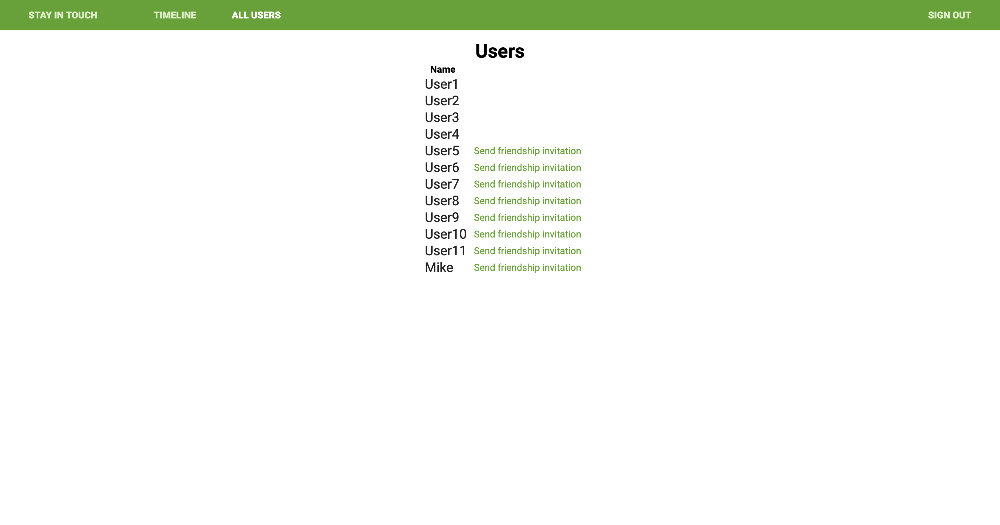
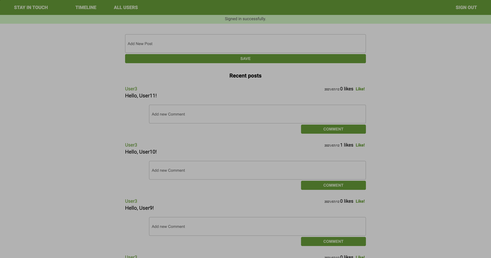

# Social media app with Ruby on Rails

> This is a social media app featuring Friendships, friendship request, posts, comments and likes. Now it also features API responses with endpoints /api/v1 that respond to token authentication with JWT 


## Screenshot



## [Live Version](https://infinite-plateau-85135.herokuapp.com/)

## Built With

- Ruby v2.7.2
- Ruby on Rails v5.2.4


## Getting Started

To get a local copy up and running follow these simple example steps.

### Prerequisites

- Ruby v2.7.2
- Ruby on Rails v5.2.4

**This project is not supported by ruby 3.x or rails 6.x**
Postgres: >=9.5

### Setup

Install gems with dependancies:

```
bundle install
```

Setup database with:

**Configure postgress for the database to work**

```
   export DEVISE_JWT_SECRET_KEY=`bundle exec rake secret
   rails db:create
   rails db:migrate
```

### Usage

Start server with:

```
    rails server
```

Open `http://localhost:3000/` in your browser.

API endpoints:
headers:
{
    'Content-Type': application/json' \
}

http://localhost:3000/api/v1/signup

body:
{ "user": { 
    "name": "User name",
    "email": "User email", 
    "password": "User password", 
    "password_confirmation": "User password confirmation" 
    } 
    
}
http://localhost:3000/api/v1/login

body:
{ "user": { 
    "email": "User email", 
    "password": "User password"    
    }
}

**Login and Signup will return the Bearer JWT Token for authentication**

headers: {
    'Content-Type': application/json',
    'Authorization': Bearer **JWT TOKEN**
}

GET
http://localhost:3000/api/v1/users/:user_id/posts/:posts_id/comments

POST
http://localhost:3000/api/v1/posts

http://localhost:3000/api/v1/users/:user_id/posts/:posts_id/comments

body:
{
    "content": "your post or comment here"
}


### Run tests
Run test from the project root directory
- `bundle exec rpsec` to run all the test
- `bundle exec rspec spec/models` to run unit tests
- `bundle exec rspec spec/features` to run integration tests.

**Chrome is needed to run the integration tests**


## Authors

## Author

👤 **Andres Felipe Castañeda Ramos**
- Github: [@afcastaneda223](https://github.com/afcastaneda223)
- Twitter: [@afcastaneda](https://twitter.com/afcastaneda)
- Linkedin: [Andres Felipe Castañeda](https://www.linkedin.com/in/andcast)

👤 **Lucas Ferrari Soto**

- GitHub: [@notlfish](https://github.com/notlfish)
- Twitter: [@LucasFerrariSo1](https://twitter.com/LucasFerrariSo1)
- LinkedIn: [LinkedIn](https://www.linkedin.com/in/lucas-mauricio-ferrari-soto-472a3515a/)


## 🤝 Contributing

Contributions, issues and feature requests are welcome!

Feel free to check the [issues page](issues/).

## Show your support

Give a ⭐️ if you like this project!

## Acknowledgments

Forked and expanded from [microverse repository](https://github.com/microverseinc/ror-social-scaffold)

## 📝 License

TBA
